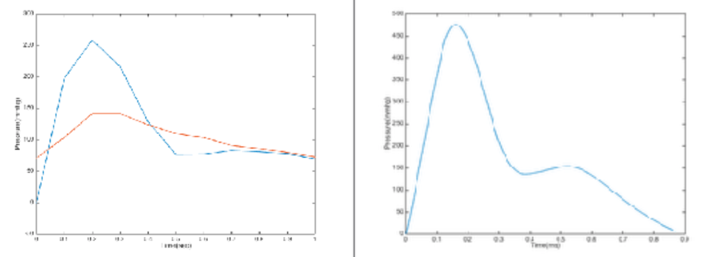

<!DOCTYPE html>
<html lang="en-US">
  <head>
    <meta charset="UTF-8">
    <meta http-equiv="X-UA-Compatible" content="IE=edge">
    <meta name="viewport" content="width=device-width, initial-scale=1">

<!-- Begin Jekyll SEO tag v2.5.0 -->
<title>About-Me</title>
<meta name="generator" content="Jekyll v3.7.4" />
<meta property="og:title" content="About-Me" />
<meta property="og:locale" content="en_US" />
<link rel="canonical" href="https://vaibhavmurali.github.io/About-Me/" />
<meta property="og:url" content="https://vaibhavmurali.github.io/About-Me/" />
<meta property="og:site_name" content="About-Me" />

<!-- End Jekyll SEO tag -->

    <link rel="stylesheet" href="/About-Me/assets/css/style.css?v=2bcc4d1dcffdc8e89119612dc33d70984393e282">
  </head>
  <body>
    

      
      <h1><a href="https://vaibhavmurali.github.io/About-Me/">About-Me</a></h1>
      

      
<html>
  <head>
  <meta name="generator" content="HTML Tidy for Linux/x86 (vers 11 February 2007), see www.w3.org" />
  
  <link rel="icon" type="image/png" href="seal_icon.png" />
  <title>Vaibhav Murali</title>
  <meta http-equiv="Content-Type" content="text/html; charset=us-ascii" />
  <link href="http://fonts.googleapis.com/css?family=Lato:400,700,400italic,700italic" rel="stylesheet" type="text/css" />
  </head>
  <body>
        

          <name>Vaibhav Murali</name>
        

        

          Hey! I am a graduate student at <a href="https://www.usc.edu/">University of Southern California, Los Angeles </a>
          - California, pursuing my Master's in Medical Device and Diagnostic Engineering. I am interested in the field of Bio-Instrumentation and Hardware Engineering. I am also open to Embedded roles and have worked in Signal Processing. I have had a great deal of laboratory experience in instrumentation, both indoors as well as on-field.  I am keenly willing to contribute my best to work on the latest technologies in the field of Medical Devices that will lead to the betterment of the society. 
 	  I obtained my bachelor's degree in Biomedical Engineering Engineering from <a href="http://www.ssn.edu.in">SSN College of Engineering, Anna University</a> in June 2017. I have worked on several projects ranging from Laboratory Model of Low Cost Dialysis Machine to building an artifical neuron of which has provided me with a unique learning experience. 
            I interned at Philips Innovation during Summer'16 where I worked on CT, MRI, Ultrasound and ECG Machines. 	

        
  
      
      
      

       
           <a href="mailto:vmurali@usc.edu">Email</a> 
          <a href="Resume_Biomedical.pdf">CV</a> 
          <a href="https://www.linkedin.com/in/vaibhavmurali/"> LinkedIn </a>
        

     
     
          <heading>Research Projects</heading>
      <table class="compact" border="0" align="center" cellspacing="0" cellpadding="20">
  		
	        <tr>
  			<td width="33%">

  			     

  			</td>
  			<td valign="top" width="67%">
  				

  					<papertitle>Laboratory Model of Low Cost Dialysis Machine</papertitle>  Vaibhav Murali, Gopi Chandran, Surya Prakash &nbsp;|&nbsp; Spring 2017
  					

  						We engineered a cost effective machine that performs basic operations such as monitoring pressure, temperature and detecting air bubbles present inside blood drawn from patient. 
  					

  					<a href="thesis_full.pdf">Report</a>
					
	    <a href="https://youtu.be/lMehuQO2PqY">Video 1</a>
	    
	    <a href="https://youtu.be/lzvbQXVOrNc">Video 2</a>

	    <a href="https://youtu.be/Eh6AA_WfIKk">Video 3</a>
  			
      		<tr>
  			<td width="33%">

  			     

  			</td>
  			<td valign="top" width="67%">
  				

  					<papertitle>Transcutaneous electrical nerve stimulation using EEG</papertitle>  Vaibhav Murali  &nbsp;|&nbsp; Fall 2018
  					

                Research project aimed at treating pain automatically based on EEG pattern. Involved designing a cap with electrodes embedded on it to extract brain waves along with appropriate signal processing to get a meaningful signal to treat pain
				

     <a href="VaibhavMurali_FeasibilityReport.pdf">Report</a>
  <tr>
      <td width="33%">

           

      </td>
      <td valign="top" width="67%">
        

          <papertitle>Design of Artificial Neuron</papertitle>  Vaibhav Murali &nbsp;|&nbsp; Fall 2018
          

            Implemented Mealy Machine circuit using Cadence Virtuoso. It involved flipflops &amp; compound gates to replicate the firing of neurons. 

          <a href="MuraliLab3.pdf">Report</a>
    <tr>
    <td width="33%">

         

    </td>
    <td valign="top" width="67%">
      

        <papertitle>Design of Ultrasound Airflow Transducer</papertitle>   Vaibhav Murali &nbsp;|&nbsp; Spring 2018
        

          Developed an ultrasound transducer model in LT SPICE and simulated the same. This model shows us the linear relationship of volume over time the for three flow rates.
 

        <a href="Q1.pdf">Report</a> 
      
  <tr>
  <td width="33%">

       

  </td>
  <td valign="top" width="67%">
    

     <papertitle>Design of Brain Tissue Oximeter</papertitle>   Vaibhav Murali &nbsp;|&nbsp; Spring 2018
        

          Developed a brain tissue oximeter using 555 timers in LT SPICE. Also generated diode current driver circuit for constant current during activation of timer. The model was then simulated using LT SPICE.
 

        <a href="Q2.pdf">Report</a> 
<tr>
    <td width="33%">

         

    </td>
    <td valign="top" width="67%">
      

        <papertitle>Simulation of Grodin's Model</papertitle>   Vaibhav Murali &nbsp;|&nbsp; Fall 2017
        

          Simulated Grodins Model in MATLAB. Modified controller equation to predict periodic breathing in normal and heart failure.
 

        <a href="projectreport.pdf">Report</a> 
	<tr>
    <td width="33%">

         

    </td>
    <td valign="top" width="67%">
      

        <papertitle>Implementation of radial artery to aortic transfer function</papertitle>   Vaibhav Murali &nbsp;|&nbsp; Fall 2017
        

         Constructed a linear circuit to calculate transfer function. Observed aortic flow during normal and abnormal heart conditions in MATLAB.
 

        <a href="Extracredit.pdf">Report</a> 
	

</td></tr>
</td></tr>
</td></tr>
</td></tr>
</td></tr>
</td></tr>
</td></tr></table></body></html>

      
    

    
    
    
  </body>
</html>
